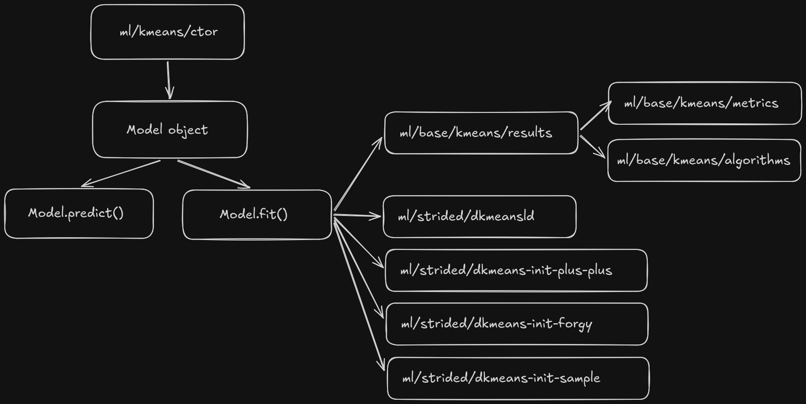
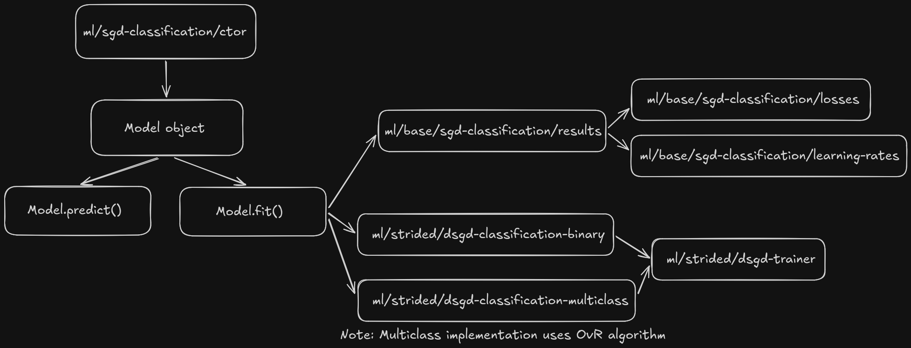
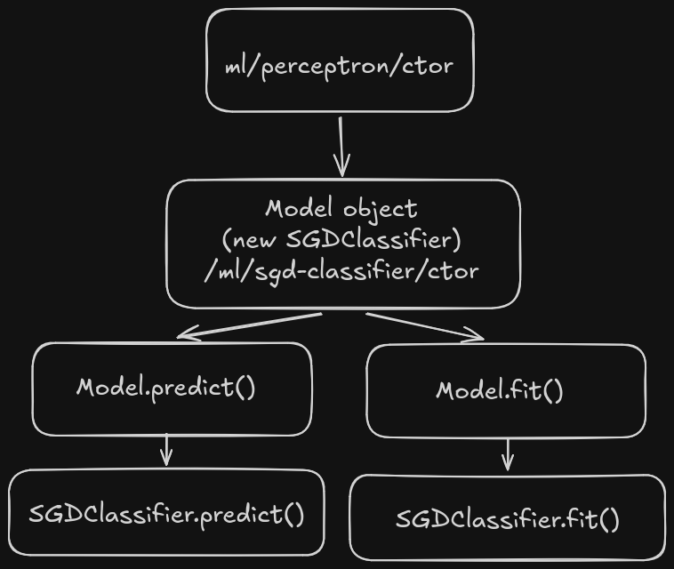
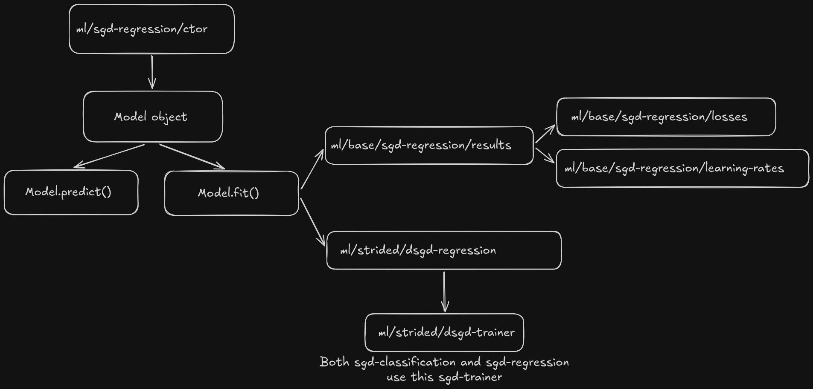

## Distance Metrics

- `stats/strided/dpcorr`
- `stats/strided/distances/dcorrelation`

---

## Loss Functions

- `ml/loss/hinge`

	```javascript
	// ml/loss/dhinge/lib/dhinge.js
	var max = require( '@stdlib/math/base/special/max' );

	function dhinge( y, p ) {
		return max( 0, 1 - ( y*p ) );
	}
	```

	```javascript
	// ml/loss/dhinge/lib/dhinge.native.js
	var addon = require( './../src/addon.node' );

	function dhinge( y, p ) {
		return addon( y, p );
	}
	```

	```javascript
	// ml/loss/dhinge/lib/main.js
	var setReadOnly = require( '@stdlib/utils/define-nonenumerable-read-only-property' );
	var dhinge = require( './dhinge.js' );
	var ndarray = require( './ndarray.js' );

	setReadOnly( dhinge, 'gradient', gradient );
	```

	```javascript
	// ml/loss/dhinge/lib/gradient.js
	function gradient( y, p ) {
		if ( y*p < 1 ) {
			return -y;
		}
		return 0;
	}
	```

	```javascript
	// ml/loss/dhinge/lib/gradient.native.js
	var addon = require( './../src/addon.node' );

	function gradient( y, p ) {
		return addon.gradient( y, p );
	}
	```

- `ml/loss/dlog`
- `ml/loss/dmodified-huber`
- `ml/loss/dsquared-hinge` 
- `ml/loss/dperceptron`
- `ml/loss/dsquared-error`
- `ml/loss/dhuber`
- `ml/loss/depsilon-insensitive`
- `ml/loss/dsquared-epsilon-insensitive`

---

## KMeans Clustering

<details>
<summary>
  <code>ml/kmeans/strided/dkmeans-init-plus-plus</code> <b>[ Difficulty : 3/5 ]</b> (2-3 days)
</summary>
<br>

References: 
- [Wikipedia](https://en.wikipedia.org/wiki/K-means%2B%2B#Improved_initialization_algorithm)
- [sklearn](https://github.com/scikit-learn/scikit-learn/blob/fe2edb3cdbd75ae4e662fda67dcb19277258792b/sklearn/cluster/_kmeans.py#L74)
- [dlib](https://github.com/davisking/dlib/blob/0828f313d4221f1f24d8d14dfbaa98f3c04f7e9f/dlib/svm/kkmeans.h#L302)
- [`@stdlib/ml/incr/kmeans`](https://github.com/stdlib-js/stdlib/blob/develop/lib/node_modules/%40stdlib/ml/incr/kmeans/lib/init_kmeansplusplus.js)

```javascript
function dkmeansplusplus() {}
function ndarray() {}
```

</details>

<br>

<details>
<summary>
  <code>ml/kmeans/strided/dkmeans-init-forgy</code> <b>[ Difficulty : 2/5 ]</b> (2-3 days)
</summary>
<br>

References:
- [`@stdlib/ml/incr/kmeans`](https://github.com/stdlib-js/stdlib/blob/develop/lib/node_modules/%40stdlib/ml/incr/kmeans/lib/init_forgy.js)

</details>

<br>

<details>
<summary>
  <code>ml/kmeans/strided/dkmeans-init-sample</code> <b>[ Difficulty : 2/5 ]</b> (2-3 days)
</summary>
<br>

References:
- [`@stdlib/ml/incr/kmeans`](https://github.com/stdlib-js/stdlib/blob/develop/lib/node_modules/%40stdlib/ml/incr/kmeans/lib/init_sample.js)

</details>

<br>

<details>
<summary>
  <code>ml/strided/dkmeansld</code> <b>[ Difficulty : 4/5 ]</b> (6-7 days)
</summary>
  <br>

  - Add javascript implementation for `ml/strided/dkmeansld` [PR](https://github.com/stdlib-js/stdlib/pull/9703)
  - Add C implementation for `ml/strided/dkmeansld`
  - Add tests for `ml/strided/dkmeansld`
  - Add benchmarks for `ml/strided/dkmeansld`
  - Add examples for `ml/strided/dkmeansld`
  
  References:
  - [dlib](https://github.com/davisking/dlib/blob/master/dlib/test/kmeans.cpp#L51)

</details>

<br>

<details>
<summary>
  <code>ml/base/kmeans/results</code> <b>[ Difficulty : 2/5 ]</b> (2-3 days)
</summary>
<br>

  **Metrics enum**
   - Add `ml/base/kmeans/metrics` [PR](https://github.com/stdlib-js/stdlib/pull/10714)
   - Add `ml/base/kmeans/metric-str2enum` [PR](https://github.com/stdlib-js/stdlib/pull/10842)
   - Add `ml/base/kmeans/metric-enum2str` [PR](https://github.com/stdlib-js/stdlib/pull/10841)
   - Add `ml/base/kmeans/metric-resolve-enum`
   - Add `ml/base/kmeans/metric-resolve-str`
   <br>

  **Algorithms enum**
   - Add `ml/base/kmeans/algorithms` [PR](https://github.com/stdlib-js/stdlib/pull/10796)
   - Add `ml/base/kmeans/algorithm-str2enum`
   - Add `ml/base/kmeans/algorithm-enum2str`
   - Add `ml/base/kmeans/algorithm-resolve-enum`
   - Add `ml/base/kmeans/algorithm-resolve-str`
  
  **Results object**
   - Add `ml/base/kmeans/results/factory`
   - Add `ml/base/kmeans/results/float32`
   - Add `ml/base/kmeans/results/float64`
   - Add `ml/base/kmeans/results/struct-factory`
   - Add `ml/base/kmeans/results/to-json`
   - Add `ml/base/kmeans/results/to-string`
   
   ```typescript
	interface Results {
		/*
		* Number of times the data was clustered with different initial centroids.
		*/
		replicates?: number;

		/*
		* Index of the initial centroids which produced the best result.
		*/
		replicate?: number;

		/*
		* Clustering algorithm name.
		*/
		metric?: Metric;

		/*
		* Number of iterations for best results.
		*/
		iterations?: number;

		/*
		* Clustering algorithm.
		*/
		algorithm?: Algorithm;

		/*
		* Sum of squared distances to the closest centroid for all samples.
		*/
		inertia?: number;

		/*
		* Number of clusters.
		*/
		k?: number;

		/*
		* Number of samples.
		*/
		samples?: number;

		/*
		* Number of features.
		*/
		features?: number;

		/*
		* Centroids.
		*/
		centroids: ndarray;

		/*
		* Statistics
		*/
		statistics: ndarray;
	}
   ```

</details>

<br>

<details>
<summary>
  <code>ml/kmeans/ctor</code> <b>[ Difficulty : 3/5 ]</b> (3-5 days)
</summary>
<br>

   ```javascript
	// ml/kmeans/ctor/lib/main.js
	function kmeans( k, options ) {

		// Validate inputs
		// ...
		// options should contain
		// - options.init {string}
		// - options.centroids {ndarray} // only use it if options.init is not set
		// - 
		
		// Initialize new model constructor
		model = new Model( k, opts );
		
		// Initialize kmeans model object
		obj = {};
		
		// Attach methods to the kmeans model object:
		// Inspired by how ztest handles an out object with a print function attached to it.
		// https://github.com/stdlib-js/stdlib/blob/develop/lib/node_modules/%40stdlib/stats/ztest/lib/main.js
		setReadOnly( accumulator, 'fit', fit );
		setReadOnly( accumulator, 'predict', predict );
		
		return obj;
		
		function fit( X, y ) {
			// Validate inputs
			// ...

			// Use model object
			model.fit( X, y );
			return model.results;
		}
		
		function predict( x ) {
			// Validate inputs
			// ...

			// Use model object
			return model.predict( x );
		}
	}
   ```

   ```javascript
	// ml/kmeans/ctor/lib/model.js
	function Model( k, opts ) {
		// Set internal properties and initialize arrays
		this._k = k;
		this._opts = opts;
	
		// ....
		
		return this;
		
	}
	
	setReadOnly( Model.prototype, 'fit', function fit( X, y ) {
		var r;
		
		// results object is passed into dkmeansld as an argument
		for ( r = 0; r < this._reps; r++ ) {
			dkmeansld( N, M, k, X, ..., y, ..., this.out );
		}
		// if the above iteration over replicates should live inside the `dkmeansld` function or here is still TBD
		return out;
	});
	
	setReadOnly( Model.prototype, 'predict', function predict( X, y ) {
		...
	});
   ```
To handle the case where use passes predefined centroids, I have two C APIs for kmeans, `stdlib_kmeans_allocate` and `stdlib_kmeans_allocate_with_centroids`.

   ```C
	// ml/kmeans/ctor/src/main.c
	struct kmeans * stdlib_kmeans_allocate( int64_t N, char* init, ... ) {
		
		struct stdlib_kmeans_model *model = stdlib_kmeans_model_allocate( N, init, ... );
		struct kmeans *obj = malloc( sizeof( struct kmeans ) );
		
		// set object properties here, for example
		obj->N = N;
		obj->model = model;
	
		return obj;
	}

	struct kmeans * stdlib_kmeans_allocate_with_centroids( int64_t N, const struct ndarray *init, ... ) {
		
		struct stdlib_kmeans_model *model = stdlib_kmeans_model_allocate_with_centroids( N, init, ... );
		struct kmeans *obj = malloc( sizeof( struct kmeans ) );
		
		// set object properties here, for example
		obj->N = N;
		obj->model = model;
	
		return obj;
	}
	
	struct stdlib_kmeans_results * stdlib_kmeans_fit( const struct kmeans *obj, const struct ndarray *X, const struct ndarray *Y ) {
	
		stdlib_kmeans_model_fit( obj->model, X, Y );
		return stdlib_kmeans_model_get_results( obj->model );
	}
	
	struct ndarray * stdlib_kmeans_predict( const struct kmeans *obj, const struct ndarray *X ) {
		return stdlib_kmeans_model_predict( obj->model, X );
	}
	
	void stdlib_kmeans_free(struct kmeans *obj) {
		if (!obj) return;
	
		stdlib_kmeans_model_free(obj->model);
		free(obj);
	}
   ```
</details>

<br>


 
---

## SGD Classification

- `ml/sgd-classification/ctor`
- `ml/strided/dsgd-trainer`
- `ml/strided/dsgd-classification-binary`
- `ml/strided/dsgd-classification-multiclass`
- `ml/base/sgd-classification/results`
	```typescript
	interface Results {
		/*
		* Weights assigned to features.
		*
		* Note: It is of shape (1, N) if n_classes == 2 else (n_classes, N) as it does OvR
		* 
		*/
		coefficients?: ndarray;

		/*
		* Constants in decision function
		* Note: It is of shape (1,) if n_classes == 2 else (n_classes,)
		*/
		intercept?: Float64Array | Float32Array;
		
		/*
		* Number of iterations for best results.
		*/
		iterations?: number;

		/*
		* Number of classes.
		*/
		k?: number;

		/*
		* Number of samples.
		*/
		samples?: number;

		/*
		* Number of features.
		*/
		features?: number;

		/*
		* Loss function.
		*/
		loss?: Loss;

		/*
		* Learning rate schedule.
		*/
		lr?: LearningRate;

		/*
		* Statistics
		*/
		statistics?: ndarray;
	}
   ```

- `ml/base/sgd-classification/losses`
- `ml/base/sgd-classification/learningRates`



## Perceptron

- `ml/perceptron/ctor`

```javascript
// N is the number of features
function perceptron( N, options ) {
    var model;
    var obj;

    options.loss = "perceptron";
    options.learningRate = "constant";
    model = new SGDClassifier( N, options );
    
    obj = {};
    
    setReadOnly( obj, 'fit', fit );
    setReadOnly( obj, 'predict', predict );
    
    return obj;
    
    function fit( X, y ) {
        return model.fit( X, y );
    }
    
    function predict( X ) {
        return model.predict( X );
    }
}
```



---

## SGD Regression

- `ml/sgd-regression/ctor`
- `ml/strided/dsgd-regression`
- `ml/base/sgd-regression/results`
- `ml/base/sgd-classification/losses`
- `ml/base/sgd-classification/learningRates`



```
ml/kmeans/ctor
├── benchmarks/
├── docs/
├── examples/
├── include/
├── lib/
│   ├── main.js
│   ├── index.js
│   ├── model.js
│   ├── fit.js
│   ├── predict.js
│   └── validate.js
├── src/
│   ├── main.c
│   ├── model.c
│   ├── fit.c
│   └── predict.c
├── test/
├── README.md
├── manifest.json
└── package.json
```
```
ml/strided/dkmeansld
├── benchmarks/
├── docs/
├── examples/
├── include/
├── lib/
│   ├── dkmeansld.js
│   ├── dkmeansld.native.js
│   ├── index.js
│   ├── main.js
│   ├── native.js
│   ├── ndarray.js
│   └── ndarray.native.js
├── src/
│   ├── Makefile
│   ├── main.c
│   └── addon.c
├── test/
├── README.md
├── manifest.json
└── package.json
```