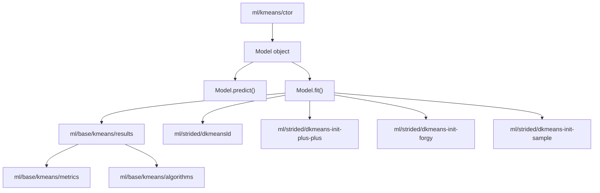
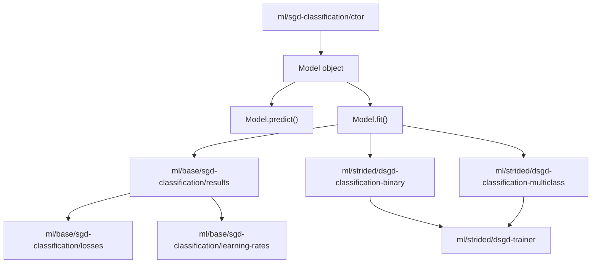
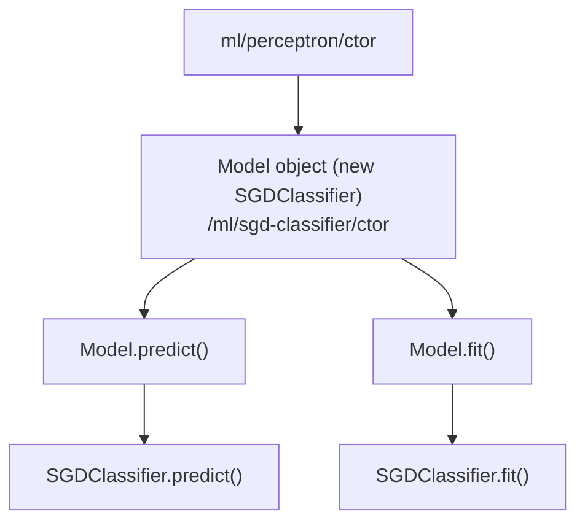
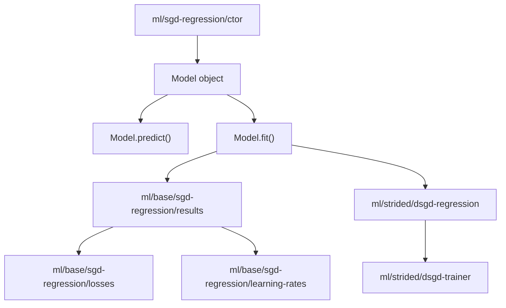

## Full name

Nakul Krishnakumar

## University status

Yes

## University name

Indian Institute of Information Technology, Kottayam

## University program

Computer Science and Engineering

## Expected graduation

2027

## Short biography

I'm currently a third year undergraduate student from Indian Institute of Information Technology, Kottayam, India pursuing BTech. in Computer Science and Engineering. From early college days, I've always been attracted to the world of Machine Learning and Statistical Analytics. This has encouraged me to explore various domains which has only made me more curious with time.

Currently I work as a Student Researcher at CyberLabs IIITK, where I am currently researching about federated learning, differential privacy and how it can be incorporated on blockchain (mostly Python, Javascript and Golang). Regarding course works, I have done High Performance Computing (in Python, C++), Parallel and Distributed Computing (in C++, OpenMP, MPI), Data Structures and Algorithms (in C++), Data Mining (in R), Web Development (in Javascript) and many more.

Previously, I have won hackathons including Hac'KP 2025 where I won the Most Lightweight Solution Award as well as IndoML Datathon 2025 where our team developed a model to judge AI Evaluators and won the evaluation track. These experiences have been crucial part of my learning journey.

I have experience with Javascript, Typescript, C/C++, Python, R and Golang, I've used Nextjs, React for Web Development. Coming to machine learning and statistics, I have used PyTorch, Tensorflow, Scikit-learn, Scipy and Numpy which will be an advantage for me to successfully implement this proposal.

## Timezone

Indian Standard Time Asia/Kolkata (UTC +5:30)

## Contact details

email:nakulkrishnakumar86@gmail.com, github:nakul-krishnakumar

## Platform

Linux

## Editor

I prefer VSCode as I believe it has best of both the worlds.
It feels lightweight and fast similar to code editors like Vim and Sublime Text, but at the same time it has all the latest features including AI chatbots and many more that heavy IDEs like WebStorm, Cursor and Antigravity has.
VSCode has always been my first option because of the vast variety of extensions and customization (shout out to GitLens extension which makes PR handling and reviewing way more easier!).

## Programming experience

I started programming when I was in high school (around 5years ago), as part of it I have build many projects as well as took part (and even won some) in various challenges and competitions.
I have listed some of my personal favourite projects that I have built below:
- [MarcAI](https://github.com/nakul-krishnakumar/marc-ai) : A multi-agent code review system which uses a variety of opensource static analysis and linting tools (ruff, eslint, semgrep, bandit and radon) to analyze and find issues from the mentioned github repository. These tools find the errors and warnings and then passes it to a consolidator agent (LLM) which generates a brief summary on how to solve the issues. 
- [VidhAI](https://github.com/nakul-krishnakumar/vidh-ai) : An AI legal assistant designed to help Indian Citizens understand indian legal rules (Bharatiya Nyaya Sanhita). Built using RAG and OpenAI's embedding and chat generation models.
- [Z.ly](https://github.com/nakul-krishnakumar/url-shortener) : A simple and efficent URL Shortener that generates shortened URLs for long links and tracks them. Built using Node.js and mongodb.
- [Multimodal Injection Detector](https://github.com/nakul-krishnakumar/multimodal-injection-detector) : A custom made dataset similar to Meta CyberSecEval3 dataset to benchmark multimodal LLMs on injection detection.

Other than personal projects, I am currently a maintainer of a project under Kerala Police Cyberdome, helping fight against Child Sexual Abuse Material all over India (mainly Javascript and Python).

## JavaScript experience

I have used ReactJS, NextJS, ExpressJS and NodeJS for Web development, both in coursework and freelance projects, as well as used it to learn Data Structures and Algorithms.

My favorite feature of JavaScript is its event loop. Despite being single-threaded, it handles the execution of concurrent tasks really well using the event loop.

My least favorite feature of JavaScript is the limited primitive type system. For example, all numeric values are handled by a single `number` type. However `stdlib` solves this problem really well using its custom data types.

Overall, despite these limitations, JavaScript remains extremely powerful due to its flexibility and its central role in the modern web ecosystem.

## Node.js experience

I have experience using Node.js to build scalable backend systems. 

Notably, I have built a [URL Shortener](https://github.com/nakul-krishnakumar/url-shortener) which supports server side rendering to deliver fast loading of user interfaces. 

I have also built a [leave application management system](https://github.com/nakul-krishnakumar/pls-let-me-go) for my college, in which I have used Node.js to build the backend and Express.js to build the API Services. 

## C/Fortran experience

I have explored multiple domains using C and C++.

As part of my coursework, I worked on parallel computing in C using OpenMP and MPI, where I built a project to process the Horn–Schunck Optical Flow algorithm in parallel ( [project here](https://github.com/nakul-krishnakumar/opt-flow-parallel) ). 

I am also currently learning embedded C, working with 8051 and ARM architectures as part of another course. Additionally, I have a strong foundation in Data Structures and Algorithms using C++.

My experience with Fortran began through the `stdlib` codebase, where I found concepts like column-major data storage particularly interesting. While I don’t anticipate needing to write Fortran for my current proposal, I would be very willing to learn and work with it if required.

## Interest in stdlib

What interests me most about stdlib is its mission to build a high-quality, production-ready standard library for numerical and scientific computing in JavaScript. With a background in machine learning, data processing, and mathematics, I have long been curious about how fundamental numerical and statistical operations are implemented efficiently under the hood. This curiosity translated into practical contributions, including implementing an entire [distances namespace](https://github.com/stdlib-js/stdlib/tree/develop/lib/node_modules/%40stdlib/stats/strided/distances) in stdlib with various distance metrics I had studied during my coursework.

One feature I really like about stdlib is its modular design and publishing strategy. When a package is merged, it is deployed as an individual npm module rather than forcing users to import the entire library. This allows developers to include only the specific functionality they need, which helps reduce bundle size and improves performance in real-world applications.

Personally, stdlib is very meaningful to me as it represents my first experience engaging deeply with a large-scale open-source codebase. It has given me exposure to writing production-quality code, understanding design decisions, and appreciating the level of detail required in building foundational libraries. Also the weekly hours really helped me build my collaborative skills.

## Version control

Yes

## Contributions to stdlib

#### Merged Works
I have contributed multiple pull requests that have been successfully merged. My main work has been in the `math/base/special` and `stats/strided` namespaces ([Merged PRs](https://github.com/stdlib-js/stdlib/pulls?q=is%3Apr+author%3Anakul-krishnakumar+is%3Aclosed)). This includes:
- Adding **C and JS implementations** for special math functions like [#9046](https://github.com/stdlib-js/stdlib/pull/9046), [#8893](https://github.com/stdlib-js/stdlib/pull/8893), [#7983](https://github.com/stdlib-js/stdlib/pull/7983) etc.
- Adding **C and JS implementations** for strided distance metrics like [#9680](https://github.com/stdlib-js/stdlib/pull/9680), [#9586](https://github.com/stdlib-js/stdlib/pull/9586), [#9559](https://github.com/stdlib-js/stdlib/pull/9559) etc.
- Adding **C and JS implementations** for strided statistical algorithms like [#9647](https://github.com/stdlib-js/stdlib/pull/9647), [#8556](https://github.com/stdlib-js/stdlib/pull/8556), [#8722](https://github.com/stdlib-js/stdlib/pull/8722) etc.
- **Migrate** `stats/strided/distances/dchebychev` to `stats/strided/distances/dchebyshev` : [#10420](https://github.com/stdlib-js/stdlib/pull/10420).
- Adding **structured package data** for special math functions like [#8346](https://github.com/stdlib-js/stdlib/pull/8346), [#7962](https://github.com/stdlib-js/stdlib/pull/7962), [#8271](https://github.com/stdlib-js/stdlib/pull/8271) etc.
- Performing **cleanup and fixes** where ever necessary like [#10690](https://github.com/stdlib-js/stdlib/pull/10690), [#10563](https://github.com/stdlib-js/stdlib/pull/10563) etc.

In total I have successfully merged 46 PRs. [link](https://github.com/stdlib-js/stdlib/pulls?q=is%3Apr+is%3Aclosed+author%3Anakul-krishnakumar)

#### Open Work
I currently have open pull requests that are under review, mostly focused on ml-kmeans, distance metrics, and mathematical functions. [Open Work](https://github.com/stdlib-js/stdlib/pulls/nakul-krishnakumar)

#### Code Reviews
I have helped in code reviews, largely revolving around distance metrics, statistical algorithms and math functions. [Code Reviews](https://github.com/stdlib-js/stdlib/pulls?q=is%3Apr+involves%3Anakul-krishnakumar+-author%3Anakul-krishnakumar+)

### stdlib showcase

##### Distance Metrics Playground
- This project uses `@stdlib/stats-strided-distances` package to compare and play around with distance metrics.
- [Code](https://github.com/nakul-krishnakumar/stdlib-showcase)
- [Live](https://metrics-pg.vercel.app/)

## Goals

The goal of this project is to lay the foundation of machine learning algorithms in stdlib library, focusing on `@stdlib/ml` namespace.

#### Main Goals:
- Plan out API Designs for machine learning APIs.
- Implement both Javascript and C implementations of ML algorithms, which will be crucial for future machine learning related work in stdlib.
- Implement dependency algorithms required for these APIs.

#### Additional Goals:
- Refactor [`ml/incr/*`](https://github.com/stdlib-js/stdlib/tree/develop/lib/node_modules/%40stdlib/ml/incr/) algorithms to follow newer conventions (including supporting the new distance metric implementations).
- Write documentations and user guides on effectively using the ML APIs. ( Ref: [sklearn-kmeans-demo](https://scikit-learn.org/stable/auto_examples/cluster/plot_kmeans_digits.html) )

Here, the main goals and additional goals can be worked in parallel, but the main goals are more prioritized. I plan to track progress through issues or other means so that I can clearly document any pending work, making it easier for future contributors or myself to continue implementation.

## Approach
#### Loss functions
For loss functions, I plan on following the below design:
Currently I believe the loss functions implemented inside [`@stdlib/ml/incr/sgd-regression`](https://github.com/stdlib-js/stdlib/blob/develop/lib/node_modules/%40stdlib/ml/incr/sgd-regression/lib/main.js) and [`@stdlib/ml/incr/binary-classification`](https://github.com/stdlib-js/stdlib/tree/develop/lib/node_modules/%40stdlib/ml/incr/binary-classification) do an entire optimization step (SGD) rather than simply calculating the `loss(y, p)`. What I plan to do is that the standalone loss function can be used to find the loss or gradient and under packages like `sgd-classification`, it can be used inside an `_optimize()` function as mentioned below:

```javascript
// ml/loss/dhinge/lib/dhinge.js
var max = require( '@stdlib/math/base/special/max' );

function dhinge( y, p ) {
    return max( 0, 1 - ( y*p ) );
}
```

```javascript
// ml/loss/dhinge/lib/dhinge.native.js
var addon = require( './../src/addon.node' );

function dhinge( y, p ) {
	return addon( y, p );
}
```

```javascript
// ml/loss/dhinge/lib/main.js
var setReadOnly = require( '@stdlib/utils/define-nonenumerable-read-only-property' );
var dhinge = require( './dhinge.js' );
var ndarray = require( './ndarray.js' );

setReadOnly( dhinge, 'gradient', gradient );
```

```javascript
// ml/loss/dhinge/lib/gradient.js
function gradient( y, p ) {
    if ( y*p < 1 ) {
        return -y;
    }
    return 0;
}
```

```javascript
// ml/loss/dhinge/lib/gradient.native.js
var addon = require( './../src/addon.node' );

function gradient( y, p ) {
	return addon.gradient( y, p );
}
```

```javascript
// ml/strided/dsgd-trainer
function _optimize( w, x, y ) {
    var err;
    var eta;
    var p;
    var g;
    
	p = _dot( w, x ); // same as that implemented in `ml/incr/binary-classification`
	
    g = loss( y, p );
    
    eta = _getEta(); // according to learningRate method
    _regularize( eta ); // same as that implemented in `ml/incr/binary-classification`
    _add( w, x, -eta * g ); // same as that implemented in `ml/incr/binary-classification`
}

// This is the strided low level implementation that ctor.fit() calls
function dsgdTrainer( ... ) {
    // ...
    if ( options.loss === 'hinge' ) {
        loss = dhinge.gradient;
    } else if ( options.loss === "log" ) {
        loss =  dlog.gradient;
    } else if ( options.loss === "modifiedHuber" ) {
        loss = dmodifiedHuber.gradient;
    } else if ( options.loss === "perceptron" ) {
        loss = dperceptron.gradient;
    } else if ( options.loss === "squaredHinge") {
        loss = dsquaredHinge.gradient;
    }
    for ( epoch = 0; epoch < maxIter; epoch++ ) {
        // ...
        for ( i = 0; i < N; i++ ) {
           x = X[ strideX1 ];
           y = Y[ strideY1 ];
            _optimize( w, x, y );
        }
    }
}
```

#### ML algorithms

Regarding API Design of the ML algorithms, I plan on following the `fit/predict` pattern similar to scikit-learn. I will also take reference from the following:
- [`@stdlib/ml/incr/binary-classification`](https://github.com/stdlib-js/stdlib/blob/b28e890a665aadccae6171c311c816f59226f10b/lib/node_modules/%40stdlib/ml/incr/binary-classification/lib/model.js#L83) for handling the `Model` object.
- [`@stdlib/ndarray/ctor/src/get.c`](https://github.com/stdlib-js/stdlib/blob/develop/lib/node_modules/%40stdlib/ndarray/ctor/src/get.c) for C implementation of the constructor and prototype functions (`fit`, `predict`) of the `Model` object.
- [`@stdlib/stats/base/ztest/*`](https://github.com/stdlib-js/stdlib/blob/develop/lib/node_modules/%40stdlib/stats/base/ztest/one-sample/results/factory/lib/main.js) for handling the `Results` object that the `fit` method should be returning.

Ideally the entire KMeans implementation would consist of the following packages:
- `ml/kmeans/ctor` (User facing constructor internally handling a `Model` object).
- `ml/strided/dkmeansld` (Double precision strided implementation of Lloyd algorithm).
- `ml/strided/dkmeanselk` (Double precision strided implementation of Elkans algorithm). [OUT OF SCOPE FOR THIS PROPOSAL]
- `ml/strided/dkmeans-init-plus-plus`
- `ml/strided/dkmeans-init-forgy`
- `ml/strided/dkmeans-init-sample`
- `ml/base/kmeans/results` (Results object) [`this.out` used inside the model constructor would be an instance of this object]

Below is a high level overview of the API Design:
 ```javascript
  // ml/kmeans/ctor/lib/main.js
  function kmeans( k, options ) {
      // Validate inputs
      // ...
      
      // Initialize new model constructor
      model = new Model( k, opts );
      
      // Initialize kmeans model object
      obj = {};
      
      // Attach methods to the kmeans model object
      setReadOnly( accumulator, 'fit', fit );
      setReadOnly( accumulator, 'predict', predict );
      
      return obj;
      
      function fit( X, y ) {
          // Validate inputs
          // ...

          // Use model object
          model.fit( X, y );
          return model.results;
      }
      
      function predict( x ) {
          // Validate inputs
          // ...

          // Use model object
          return model.predict( x );
      }
  }
  ```
  ```javascript
  // ml/kmeans/ctor/lib/model.js
  function Model( N, opts ) {
      // Set internal properties and initialize arrays
      this._N = N;
      this._opts = opts;
  
      // ....
      
      return this;
      
  }
  
  setReadOnly( Model.prototype, 'fit', function fit( X, y ) {
     var r;
      
      // results object is passed into dkmeansld as an argument
     for ( r = 0; r < this._reps; r++ ) {
         dkmeansld( N, M, k, X, ..., y, ..., this.out );
     }
     // if the above iteration over replicates should live inside the `dkmeansld` function or here is still TBD
     return out;
  });
  
  setReadOnly( Model.prototype, 'predict', function predict( X, y ) {
      ...
  });
  ```

To handle the case where user passes either predefined centroids or initMethod ("kmeans++", "forgy", "sample"), I will have two C APIs for kmeans, `stdlib_kmeans_allocate` and `stdlib_kmeans_allocate_with_centroids`.

   ```C
	// ml/kmeans/ctor/src/main.c
	struct kmeans * stdlib_kmeans_allocate( int64_t N, char* init, ... ) {
		
		struct stdlib_kmeans_model *model = stdlib_kmeans_model_allocate( N, init, ... );
		struct kmeans *obj = malloc( sizeof( struct kmeans ) );
		
		// set object properties here, for example
		obj->N = N;
		obj->model = model;
	
		return obj;
	}

	struct kmeans * stdlib_kmeans_allocate_with_centroids( int64_t N, const struct ndarray *init, ... ) {
		
		struct stdlib_kmeans_model *model = stdlib_kmeans_model_allocate_with_centroids( N, init, ... );
		struct kmeans *obj = malloc( sizeof( struct kmeans ) );
		
		// set object properties here, for example
		obj->N = N;
		obj->model = model;
	
		return obj;
	}
	
	struct stdlib_kmeans_results * stdlib_kmeans_fit( const struct kmeans *obj, const struct ndarray *X, const struct ndarray *Y ) {
	
		stdlib_kmeans_model_fit( obj->model, X, Y );
		return stdlib_kmeans_model_get_results( obj->model );
	}
	
	struct ndarray * stdlib_kmeans_predict( const struct kmeans *obj, const struct ndarray *X ) {
		return stdlib_kmeans_model_predict( obj->model, X );
	}
	
	void stdlib_kmeans_free(struct kmeans *obj) {
		if (!obj) return;
	
		stdlib_kmeans_model_free(obj->model);
		free(obj);
	}
   ```

The kmeans constructor (`ml/kmeans/ctor`) will not expose direct C bindings, but it will provide a C API similar to [`@stdlib/ndarray/ctor`](https://github.com/stdlib-js/stdlib/blob/develop/lib/node_modules/%40stdlib/ndarray/ctor/src/main.c). In contrast, the strided implementation `ml/strided/dkmeansld` will include C bindings. For the C implementation of `ml/strided/dkmeansld`, I plan to follow the pattern used in [`@stdlib/stats/strided/dztest`](https://github.com/stdlib-js/stdlib/blob/develop/lib/node_modules/%40stdlib/stats/strided/dztest/src/main.c). 
The key point to note here would be using `STDLIB_NAPI_ARGV_DATAVIEW_CAST` to handle the `Results` object.

#### Perceptron

The `perceptron` is going to be a wrapper over `sgd-classification` with `loss = "perceptron"` and `learningRate="constant"`:
```javascript
// N is the number of features
function perceptron( N, options ) {
    var model;
    var obj;

    options.loss = "perceptron";
    options.learningRate = "constant";
    model = new SGDClassifier( N, options );
    
    obj = {};
    
    setReadOnly( obj, 'fit', fit );
    setReadOnly( obj, 'predict', predict );
    
    return obj;
    
    function fit( X, y ) {
        return model.fit( X, y );
    }
    
    function predict( X ) {
        return model.predict( X );
    }
}
```

Dependency Graphs:









**Note that both `sgd-classification` and `sgd-regression` use the same low level `sgd-trainer`**.

## Why this project?

#### Aim
My aim for this project would be to help design and implement machine learning algorithms in stdlib library.

#### Motive
Machine learning has been something that has taken my attention for quite a long time now. I was always curious about how we could program an algorithm or model to fit a particular trend, but it was only when I dug deeper that I realized it all comes down to mathematics and analysis. This curiosity pushed me to explore the field further, which in turn made me even more curious, creating a continuous cycle of learning.

The stdlib library has played an important role in this journey. It gave me a place to explore how the fundamental mathematical functions that machine learning algorithms rely on are implemented in practice. This led me to further explore how both traditional machine learning and deep learning algorithms are implemented in code. As part of this exploration, I studied the codebases of libraries such as scikit-learn, PyTorch, and others. While stdlib may not yet have all the components required for deep learning algorithms (like neural networks), it already provides many of the core building blocks needed for traditional machine learning algorithms (including all the distance metrics I added :P).

I also stumbled upon one of Gunj's talk (shoutout to him, he really helped me get comfortable with the library) where he mentioned how computations on the web can be much faster rather than depending on a remote server to do the computation, and we all know how much important javascript as well as stdlib is going to be for this. So I believe having this project implemented is going to be the start of a great journey that I would be really happy to be a part of. :)
Who knows, maybe in the future we might even be able to train LLMs on the web!

## Qualifications

Academically, I have completed relevant coursework such as Soft Computing, Introduction to Machine Learning, Probability and Distributions, and High Performance Computing.
Additionally, I have completed online courses including [Machine Learning by Stanford University](https://coursera.org/share/0117f749b45152170870f73ed4bacc37), [Introduction to TensorFlow for Artificial Intelligence, Machine Learning, and Deep Learning](https://coursera.org/share/dc2539f92b1dbbaec7e7c41b4c1143d8) and [Neural Networks and Deep Learning](https://coursera.org/share/0202387f9e0267e0b7d205a0584735fc).
Moreover, I have also worked on [`stats/strided/distances/*`](https://github.com/stdlib-js/stdlib/tree/develop/lib/node_modules/%40stdlib/stats/strided/distances) as well as [`blas/ext/base/*`](https://github.com/stdlib-js/stdlib/tree/develop/lib/node_modules/%40stdlib/blas/ext/base), where I implemented several prerequisite APIs relevant to this project.

## Prior art

Although this area is widely explored, this project would serve as a starting point for expanding machine learning capabilities in stdlib, which currently only includes algorithms under `ml/incr/*`. For implementations, we can take reference from well-known libraries like [sklearn](https://scikit-learn.org/stable/index.html), [scipy](https://scipy.org/), [MLJ.jl](https://juliaml.ai/ecosystem), [dlib](https://dlib.net/) and [mlpack](https://www.mlpack.org/).

#### Prior art study per API:
1. KMeans
    - Implementations:
        - [wikipedia](https://en.wikipedia.org/wiki/K-means_clustering#Standard_algorithm_(naive_k-means))
        - [sklearn](https://scikit-learn.org/stable/modules/generated/sklearn.cluster.KMeans.html)
        - [`@stdlib/ml/incr/kmeans`](https://github.com/stdlib-js/stdlib/tree/develop/lib/node_modules/%40stdlib/ml/incr/kmeans)
        - [kmeans lloyd algorithm draft PR](https://github.com/stdlib-js/stdlib/pull/9703)
        - [dlib](https://dlib.net/dlib/svm/kkmeans_abstract.h.html#find_clusters_using_kmeans), [Code](https://github.com/davisking/dlib/blob/0828f313d4221f1f24d8d14dfbaa98f3c04f7e9f/dlib/svm/kkmeans.h#L389)
        - [Clustering.jl](https://juliastats.org/Clustering.jl/stable/kmeans.html)
        - [MATLAB](https://in.mathworks.com/help/stats/kmeans.html)
    - sklearn API supports both `lloyd` and `elkan` algorithm, but `elkan` algorithm would be out of scope for this proposal.
    - The K-means APIs in sklearn and Clustering.jl only support the `squared-euclidean` distance metric, whereas MATLAB and `@stdlib/ml/incr/kmeans` support multiple distance metrics. I plan to proceed with the latter approach.


2. SGD Classifier
    - Implementations:
        - [sklearn](https://scikit-learn.org/stable/modules/generated/sklearn.linear_model.SGDClassifier.html#sklearn.linear_model.SGDClassifier), [Code](https://github.com/scikit-learn/scikit-learn/blob/d3898d9d57aeb1e960d266613a2e31b07bca39d7/sklearn/linear_model/_sgd_fast.pyx.tp#L274)
        - [`@stdlib/ml/incr/binary-classification`](https://github.com/stdlib-js/stdlib/tree/develop/lib/node_modules/%40stdlib/ml/incr/binary-classification)
        - [dlib OvA algorithm](https://dlib.net/dlib/svm/one_vs_all_trainer_abstract.h.html#one_vs_all_trainer), [Code](https://github.com/davisking/dlib/blob/master/dlib/svm/one_vs_all_trainer.h)
    - the sklearn API supports both multiclass and binary classification, but the `@stdlib/ml/incr/binary-classification` API supports only binary classification.
        - sklearn implements multiclass classification using a strategy called OvA (One versus All) or OvR (One versus Rest). [Ref](https://github.com/scikit-learn/scikit-learn/blob/d3898d9d57aeb1e960d266613a2e31b07bca39d7/sklearn/linear_model/_stochastic_gradient.py#L785)
        - The multiclass API iteratively calls the binary class API by setting a class as positive and all other as negative, so it would be a wrapper over the binary class API.
        - API design can take heavy inspiration from  `@stdlib/ml/incr/binary-classification`.

3. Perceptron
    - Implementations:
        - [sklearn](https://scikit-learn.org/stable/modules/generated/sklearn.linear_model.Perceptron.html)
        - [mlpack](https://github.com/mlpack/mlpack/blob/master/src/mlpack/methods/perceptron/perceptron_impl.hpp)
    - `sklearn` treats it as a wrapper over `SGDClassifier` by fixing loss function and learning rate:
        ```python
        SGDClassifier(loss="perceptron", learning_rate="constant")
        ```
    - This should be an easy implementation and can be implemented as soon as we get SGDClassifier merged.


4. SGD Regression
    - Implementations:
        - [sklearn](https://scikit-learn.org/stable/modules/generated/sklearn.linear_model.SGDRegressor.html)
        - [`@stdlib/ml/incr/sgd-regression`](https://github.com/stdlib-js/stdlib/tree/develop/lib/node_modules/%40stdlib/ml/incr/sgd-regression)
   - I plan on implementing it similar to `@stdlib/ml/incr/sgd-regression` but taking inspiration from sklearn API where ever necessary.

##### Only if time persists & dependencies are implemented:

 5. Linear Regression & Ridge Regression (BLOCKED):
    - Implementations:
        - [sklearn](https://scikit-learn.org/stable/modules/generated/sklearn.linear_model.LinearRegression.html#sklearn.linear_model.LinearRegression)
        - [dlib](https://github.com/davisking/dlib/blob/master/dlib/svm/rr_trainer.h)
        - [mlpack](https://github.com/mlpack/mlpack/blob/master/src/mlpack/methods/linear_regression/linear_regression_train_main.cpp)
        - [MLJ.jl](https://github.com/JuliaAI/MLJLinearModels.jl/blob/dev/src/fit/analytical.jl)
    - Note that **Ridge Regression is Linear Least Squares with L2 regularization**, so most implementation treat Least Square Regression (Linear Regression) as Ridge Regression with `lambda = 0` (regularization constant).
    - There are multiple ways to implement Least Squares implementation:
        - Ordinary Least Squares (BLOCKED) : depends on LAPACK routines `gelsd`, `gelsy`, `gelss` (SVD based).
        - Cholesky (BLOCKED) : depends on LAPACK routines `dpotrf` and `dpotrs` (Cholesky factorization).
        - Eigen Value Decomposition (BLOCKED) : depends on LAPACK routine `dsyevd`.


6. Ridge Classifier (BLOCKED):
    - Implementations:
        - [sklearn](https://scikit-learn.org/stable/modules/generated/sklearn.linear_model.RidgeClassifier.html#sklearn.linear_model.RidgeClassifier)
    - This classifier first converts the target values into {-1, 1} and then treats the problem as a regression task (multi-output regression in the multiclass case). 
    - As soon as we can get Ridge Regression implemented, this is pretty straight forward.

**For this proposal, I plan to keep 5 and 6 optional and will implement them only if the necessary dependencies are completed.** Regardless, I will ensure their design and implementation are thoroughly studied and documented so that future contributors, or myself can complete them with ease.

**My main approach would be to stick to the base paper implementation and refer library implementations to consider tradeoffs**

## Commitment

The period from May to August (three months) falls during my summer break, allowing me to fully commit to this project as a full-time, large project (350-hour commitment). I am also prepared to contribute additional time if necessary. I will dedicate approximately 30–40 hours per week, focusing on consistent progress and well-structured pull requests.

I am also handling a research project, however I have successfully managed multiple responsibilities in the past, so I am confident in my ability to balance both effectively, maintaining equal priority for my work with stdlib.

Before GSoC officially begins, I will focus on refining my proposal and implementing dependencies necessary for the successful completion of the project.
After GSoC, I plan to properly document the work completed, address any remaining tasks, and continue implementing additional algorithms.

## Schedule

I will be refering [cookbook.md](https://github.com/nakul-krishnakumar/stdlib-showcase/blob/main/docs/cookbook.md) throughtput the proposal.

> **TL;DR:**
Getting KMeans implemented is going to be the hardest part of this proposal so I plan on dedicating the most of the first half of the timeline for it.
After the mid-term evaluation submission, the next big hurdle would be to get `sgd-classification` implemented. Rest two (`sgd-regresssion` and `perceptron`) will be wrappers over packages implemented for `sgd-classification`.

---

#### Community Bonding Period:
During the three-week community bonding period, I will focus on discussing and finalizing naming and other conventions, while also beginning initial work on the project. My work will revolve around:
- Distance Metrics **[ Difficulty : 2/5 ]**
  - Getting [#10677](https://github.com/stdlib-js/stdlib/pull/10677) merged which will unblock `@stdlib/stats/strided/dpcorr`, letting me implement `@stdlib/stats/strided/distances/dcorrelation`.
  
  - Packages:
    - `stats/strided/dpcorr`
    - `stats/strided/distances/dcorrelation`

- Implement Loss functions **[ Difficulty : 2/5 ]**
    - Getting these implemented will be pretty straight forward and can be worked on parallely.
  
    - For each loss function, everything other than the implementation, including tests, benchmarks, and documentation, would largely remain the same.
  
    - Packages:
      - `ml/loss/dhinge`
      - `ml/loss/dlog`
      - `ml/loss/dmodified-huber`
      - `ml/loss/dsquared-hinge` 
      - `ml/loss/dperceptron`
      - `ml/loss/dsquared-error`
      - `ml/loss/dhuber`
      - `ml/loss/depsilon-insensitive`
      - `ml/loss/dsquared-epsilon-insensitive`
 
---

Assuming a 12 week schedule,

####  Week 1 (May 25 - May 31) :
- During the first week, my work will focus on polishing the existing PR for `ml/strided/dkmeansld`, including adding benchmarks, documentation, tests, examples, and C implementation. I will also refine existing PRs for introducing the `ml/base/kmeans/metrics` and `ml/base/kmeans/algorithms` enums.
- Packages to implement:

  - `ml/strided/dkmeansld` **[ Difficulty : 4/5 ]** [PR](https://github.com/stdlib-js/stdlib/pull/9703)
  - **Metrics enum** **[ Difficulty : 1/5 ]**
     - `ml/base/kmeans/metrics` [PR](https://github.com/stdlib-js/stdlib/pull/10714)
     - `ml/base/kmeans/metric-str2enum` [PR](https://github.com/stdlib-js/stdlib/pull/10842)
     - `ml/base/kmeans/metric-enum2str` [PR](https://github.com/stdlib-js/stdlib/pull/10841)
     - `ml/base/kmeans/metric-resolve-enum`
     - `ml/base/kmeans/metric-resolve-str`
   <br>

  - **Algorithms enum** **[ Difficulty : 1/5 ]**
     - `ml/base/kmeans/algorithms` [PR](https://github.com/stdlib-js/stdlib/pull/10796)
     - `ml/base/kmeans/algorithm-str2enum`
     - `ml/base/kmeans/algorithm-enum2str`
     - `ml/base/kmeans/algorithm-resolve-enum`
     - `ml/base/kmeans/algorithm-resolve-str`

---

#### Week 2 (June 1 - June 7):
- I will work on implementing the cluster initialization algorithms.
  - `ml/strided/dkmeans-init-plus-plus` **[ Difficulty : 3/5 ]**
  - `ml/strided/dkmeans-init-forgy` **[ Difficulty : 2/5 ]**
- If time persists, I will parallely start implementing `ml/base/kmeans/results`

---

#### Week 3 (June 8 - June 14):
- `ml/strided/dkmeans-init-sample` **[ Difficulty : 2/5 ]**
- `ml/base/kmeans/results` **[ Difficulty : 2/5 ]**
  - Add `ml/base/kmeans/results/factory`
  - Add `ml/base/kmeans/results/float32`
  - Add `ml/base/kmeans/results/float64`
  - Add `ml/base/kmeans/results/struct-factory`
  - Add `ml/base/kmeans/results/to-json`
  - Add `ml/base/kmeans/results/to-string`
- If time persists or PRs waiting for review, I will start with Week 4 schedule.
---

#### Week 4 (June 15 - June 21):
- `ml/base/kmeans/ctor` **[ Difficulty : 4/5 ]**

- By the end of this week I expect to have all the packages  implemented necessary for the proper working of `kmeans`.

---

#### Week 5 (June 22 - June 28):

- I will start working on implementing **SGD Classification**.
- Packages to implement:
  - `ml/strided/dsgd-trainer` (This is the low level trainer that both sgd-classification as well as sgd-regression will use) **[ Difficulty : 3/5 ]**
  - **Loss enum** **[ Difficulty : 1/5 ]**
    - `ml/base/sgd-classification/losses`
    - `ml/base/sgd-classification/loss-str2enum`
    - `ml/base/sgd-classification/loss-enum2str`
    - `ml/base/sgd-classification/loss-resolve-enum`
    - `ml/base/sgd-classification/loss-resolve-str`
  - **LearningRate enum** **[ Difficulty : 1/5 ]**
    - `ml/base/sgd-classification/learning-rates`
    - `ml/base/sgd-classification/learning-rate-str2enum`
    - `ml/base/sgd-classification/learning-rate-enum2str`
    - `ml/base/sgd-classification/learning-rate-resolve-enum`
    - `ml/base/sgd-classification/learning-rate-resolve-str`
---

#### Week 6 (June 29 - July 5): (midterm)
- This would be a buffer week where I would focus on completing any remaining part of `kmeans` algorithm as well as `sgd-trainer`, so that I can document and submit for mid-term evaluation.
- Parallely I will work on `ml/base/sgd-classification/results` **[ Difficulty : 2/5 ]**
  - Add `ml/base/sgd-classification/results/factory`
  - Add `ml/base/sgd-classification/results/float32`
  - Add `ml/base/sgd-classification/results/float64`
  - Add `ml/base/sgd-classification/results/struct-factory`
  - Add `ml/base/sgd-classification/results/to-json`
  - Add `ml/base/sgd-classification/results/to-string`

---

#### Week 7:
- This week, I will work on implementing the `dsgd-classification-binary` and `dsgd-classification-multiclass`, both of which would be thin wrapper over `ml/strided/dsgd-trainer`
- Packages:
  - `ml/strided/dsgd-classification-binary` **[ Difficulty : 2/5 ]**
  - `ml/strided/dsgd-classification-multiclass` **[ Difficulty : 2/5 ]**

- If time persists, I will also start working on `ml/sgd-classification/ctor`.

---

#### Week 8:
- I will finish the work on `ml/sgd-classification/ctor` **[ Difficulty : 4/5 ]**
- By the end of this week I expect to have all the packages  implemented necessary for the proper working of `sgd-classification`.

---

#### Week 9:
- `ml/perceptron/ctor` **[ Difficulty : 4/5 ]**
- By the end of this week I expect to have all the packages  implemented necessary for the proper working of `perceptron` and then I will start working on enums required for `sgd-regression`.
- **Loss enum** **[ Difficulty : 1/5 ]**
  - `ml/base/sgd-regression/losses`
  - `ml/base/sgd-regression/loss-str2enum`
  - `ml/base/sgd-regression/loss-enum2str`
  - `ml/base/sgd-regression/loss-resolve-enum`
  - `ml/base/sgd-regression/loss-resolve-str`
- **LearningRate enum** **[ Difficulty : 1/5 ]**
  - `ml/base/sgd-regression/learning-rates`
  - `ml/base/sgd-regression/learning-rate-str2enum`
  - `ml/base/sgd-regression/learning-rate-enum2str`
  - `ml/base/sgd-regression/learning-rate-resolve-enum`
  - `ml/base/sgd-regression/learning-rate-resolve-str`

---

#### Week 10:
- `ml/strided/dsgd-regression` **[ Difficulty: 2/5 ]**
- `ml/base/sgd-regression/results` **[ Difficulty : 2/5 ]**
  - Add `ml/base/sgd-regression/results/factory`
  - Add `ml/base/sgd-regression/results/float32`
  - Add `ml/base/sgd-regression/results/float64`
  - Add `ml/base/sgd-regression/results/struct-factory`
  - Add `ml/base/sgd-regression/results/to-json`
  - Add `ml/base/sgd-regression/results/to-string`

---

#### Week 11:
- `ml/sgd-regression/ctor` **[ Difficulty: 4/5 ]**
- By the end of this week I expect to have all the packages  implemented necessary for the proper working of `sgd-regression`.
---

#### Week 12:
- This would be a buffer week to finish any leftover work.
  
---

#### Final Week:
- I will document my entire work and submit final evaluation to my mentors.


## Related issues

None so far, but if required I plan on opening an issue to track the progress.

## Checklist

- [x] I have read and understood the [Code of Conduct](https://github.com/stdlib-js/stdlib/blob/develop/CODE_OF_CONDUCT.md).
- [x] I have read and understood the application materials found in this repository.
- [x] I understand that plagiarism will not be tolerated, and I have authored this application in my own words.
- [x] I have read and understood the [patch requirement](https://github.com/stdlib-js/google-summer-of-code/blob/main/README.md#patch-requirement) which is necessary for my application to be considered for acceptance.
- [x] I have read and understood the [stdlib showcase requirement](https://github.com/stdlib-js/google-summer-of-code/blob/main/README.md#showcase-requirement) which is necessary for my application to be considered for acceptance.
- [x] The issue name begins with `[RFC]:` and succinctly describes your proposal.
- [x] I understand that, in order to apply to be a GSoC contributor, I must submit my final application to <https://summerofcode.withgoogle.com/> **before** the submission deadline.